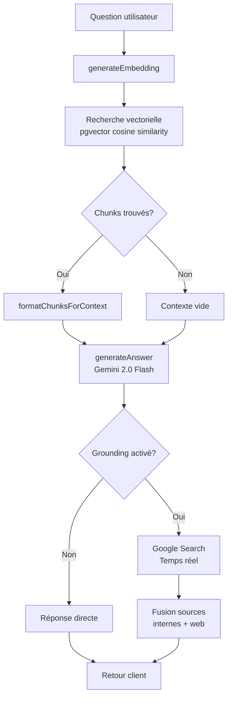
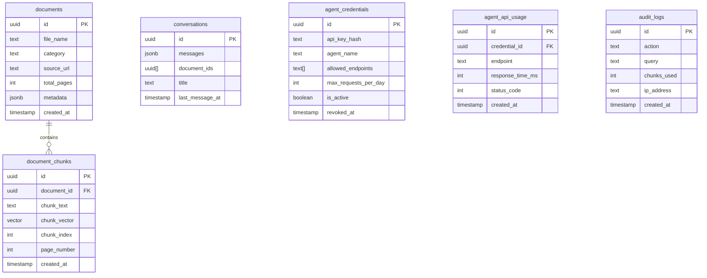
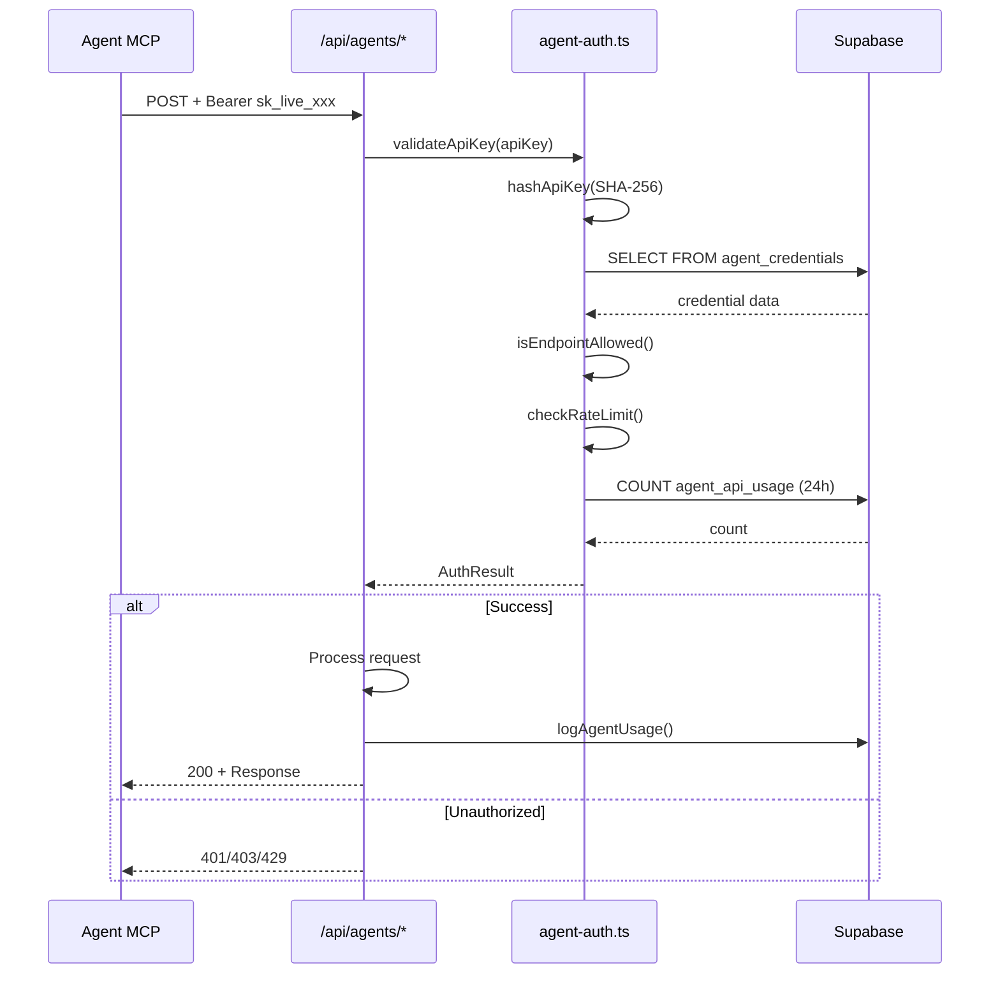

# Architecture - Yacht Legal AI

## Vue d'ensemble

Yacht Legal AI est un système RAG (Retrieval-Augmented Generation) pour l'assistance juridique maritime, construit avec Next.js 14, Supabase et Gemini.

```
+---------------------------------------------------+
|                    Frontend                        |
|  Next.js 14 App Router + React + TailwindCSS      |
|  - ChatInterface (streaming, markdown)            |
|  - DocumentUploader (PDF upload)                  |
|  - MarkdownRenderer (syntax highlighting)         |
+---------------------------------------------------+
                        |
                        v
+---------------------------------------------------+
|                   API Layer                        |
|  Next.js API Routes                               |
|  - /api/chat (RAG + Gemini)                       |
|  - /api/agents/* (API externe sécurisée)          |
|  - /api/upload-doc (ingestion PDF)                |
|  - /api/search (recherche vectorielle)            |
+---------------------------------------------------+
                        |
                        v
+---------------------------------------------------+
|                 Business Logic                     |
|  lib/                                             |
|  - gemini.ts (embeddings + génération)            |
|  - rag-pipeline.ts (recherche sémantique)         |
|  - chunker.ts (découpage documents)               |
|  - pdf-parser.ts (extraction texte)               |
|  - agent-auth.ts (authentification API)           |
+---------------------------------------------------+
                        |
                        v
+---------------------------------------------------+
|                   Data Layer                       |
|  Supabase PostgreSQL + pgvector                   |
|  - documents (métadonnées)                        |
|  - document_chunks (embeddings 768 dims)          |
|  - conversations (historique)                     |
|  - agent_credentials (API keys)                   |
+---------------------------------------------------+
```

## Stack Technique

| Composant | Technologie | Version |
|-----------|-------------|---------|
| Frontend | Next.js | 14.2.x |
| UI | TailwindCSS | 3.x |
| Runtime | Node.js | 18+ |
| Base de données | Supabase PostgreSQL | - |
| Recherche vectorielle | pgvector | 0.5+ |
| LLM | Gemini 2.0 Flash | - |
| Embeddings | gemini-embedding-001 | 768 dims |
| Markdown | react-markdown + remark-gfm | - |
| Syntax Highlighting | react-syntax-highlighter | - |

## Structure des Dossiers

```
yacht-legal-ai/
├── app/                          # Next.js App Router
│   ├── api/                      # API Routes
│   │   ├── agents/               # API pour agents externes
│   │   │   ├── query/route.ts    # RAG + génération
│   │   │   ├── search/route.ts   # Recherche vectorielle
│   │   │   └── analyze-document/ # Analyse PDF
│   │   ├── chat/route.ts         # Chat principal
│   │   ├── upload-doc/route.ts   # Upload documents
│   │   └── search/route.ts       # Recherche interne
│   ├── chat/page.tsx             # Interface chat
│   ├── documents/page.tsx        # Gestion documents
│   └── layout.tsx                # Layout racine
│
├── components/                   # Composants React
│   ├── ChatInterface.tsx         # Interface chat complète
│   ├── MarkdownRenderer.tsx      # Rendu markdown + citations
│   ├── MessageBubble.tsx         # Bulle de message
│   ├── DocumentUploader.tsx      # Upload PDF
│   └── Navbar.tsx                # Navigation
│
├── lib/                          # Logique métier
│   ├── gemini.ts                 # API Gemini (embeddings + chat)
│   ├── rag-pipeline.ts           # Pipeline RAG complet
│   ├── chunker.ts                # Découpage en chunks
│   ├── pdf-parser.ts             # Extraction texte PDF
│   ├── supabase.ts               # Client Supabase
│   ├── agent-auth.ts             # Auth API agents
│   ├── cors.ts                   # Headers CORS
│   ├── audit-logger.ts           # Logs RGPD
│   ├── types.ts                  # Types TypeScript
│   └── web-scraper.ts            # Scraping HTML
│
├── scripts/                      # Scripts d'ingestion
│   ├── ingest-simple.mjs         # Ingestion documents
│   ├── reference-urls.ts         # URLs de référence
│   └── verify-ingestion.ts       # Vérification DB
│
├── database/                     # Migrations SQL
│   └── migrations/
│       ├── 001_enable_pgvector.sql
│       ├── 002_create_documents.sql
│       ├── 003_create_document_chunks.sql
│       ├── 004_create_conversations.sql
│       ├── 005_create_audit_logs.sql
│       ├── 006_create_search_function.sql
│       ├── 007_create_rls_policies.sql
│       └── 008_create_agent_credentials.sql
│
└── public/                       # Assets statiques
```

## Pipeline RAG



### Paramètres RAG

| Paramètre | Valeur | Description |
|-----------|--------|-------------|
| Chunk size | 500 tokens | Taille optimale pour contexte |
| Overlap | 100 tokens | Chevauchement entre chunks |
| Top-K | 5 | Nombre de chunks retournés |
| Threshold | 0.7 | Score minimum de similarité |
| Embedding dims | 768 | Dimensions gemini-embedding-001 |
| Index | IVFFlat | Type d'index pgvector |

## Schéma Base de Données



## Flux d'Authentification API Agents



## Catégories de Documents

| Catégorie | Description | Exemples |
|-----------|-------------|----------|
| MYBA | Contrats charter | MYBA 2017, Sale Agreement |
| AML_KYC | Conformité anti-blanchiment | Réglementations EU, Monaco |
| MLC_2006 | Convention maritime équipage | Droits, contrats, visas |
| PAVILLONS | Registres maritimes | RIF, Cayman, Malta |
| YET | Yacht Engaged in Trade | Fiscalité TVA |
| IA_RGPD | Responsabilité légale | RGPD, disclaimers IA |
| DROIT_SOCIAL | Droit du travail | Monaco, UE |

## Sécurité

### Authentification API
- Clés API hashées SHA-256 (jamais stockées en clair)
- Préfixe visible pour identification (`sk_live_xxx...`)
- Rate limiting par credential (1000 req/jour par défaut)
- Révocation instantanée possible

### RGPD
- Table `audit_logs` avec rétention 2 ans
- Fonction `delete_old_audit_logs()` automatique
- Endpoint `/api/delete-user-data` pour droit à l'oubli
- Pas de stockage de données personnelles dans les chunks

### CORS
- Headers configurés pour tous les endpoints agents
- Preflight OPTIONS supporté
- `Access-Control-Allow-Origin: *` (configurable)

## Performance

| Métrique | Objectif | Actuel |
|----------|----------|--------|
| Temps réponse chat | < 2s | ~1.5s |
| Recherche vectorielle | < 100ms | ~50ms |
| Ingestion document | < 30s | ~15s |
| Embedding génération | < 500ms | ~300ms |

## Environnement

Variables requises dans `.env.local`:

```bash
# Supabase
NEXT_PUBLIC_SUPABASE_URL=https://xxx.supabase.co
NEXT_PUBLIC_SUPABASE_ANON_KEY=xxx
SUPABASE_SERVICE_ROLE_KEY=xxx

# Gemini
GEMINI_API_KEY=xxx

# Optionnel
MAX_REQUESTS_PER_MINUTE=10
NODE_ENV=development
```

## Extensions et Dépendances Clés

```json
{
  "@google/generative-ai": "^0.1.x",
  "@supabase/supabase-js": "^2.x",
  "react-markdown": "^9.x",
  "remark-gfm": "^4.x",
  "react-syntax-highlighter": "^15.x",
  "cheerio": "^1.0.0-rc.12",
  "pdf-parse": "^1.x"
}
```
